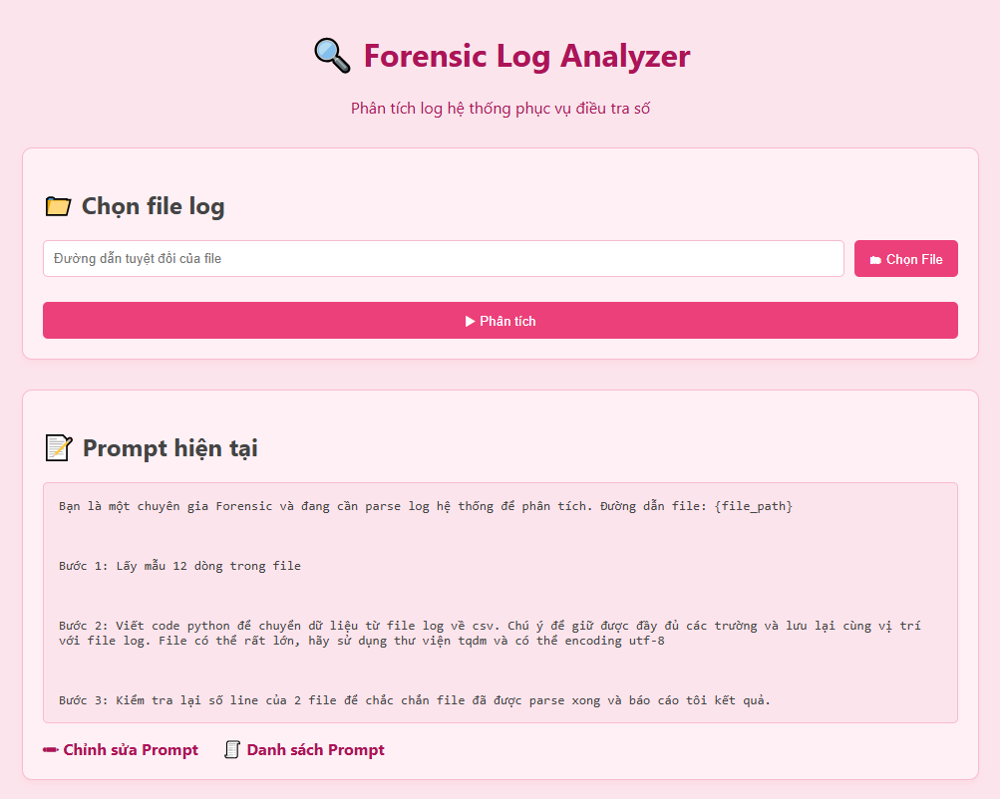
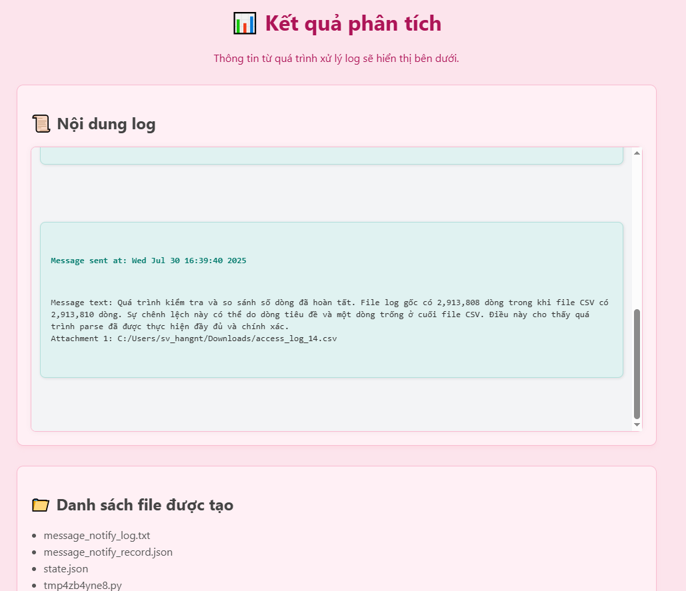

# 🔍 AI Log Analyzer & Forensic Assistant

A web-based GPT-powered tool to **automatically analyze log files**, **convert them to CSV**, and assist in **digital forensic investigations** — all through an intuitive interface.



---

## 🚀 Introduction

**AI Log Analyzer & Forensic Assistant** combines GPT and Python to:

- Read and interpret logs from various systems (web, OS, apps, etc.)
- Auto-generate Python scripts for log parsing and CSV conversion
- Execute generated code and display results in real time
- Provide user-friendly visualization and outputs

Built with simplicity and power in mind, this tool is designed for forensic professionals who want to work smarter, not harder.

---

## 🧠 Key Features

- ✅ Supports a wide range of log formats (Apache, Nginx, system logs, etc.)
- ✅ Auto-generates and runs Python code using GPT
- ✅ Converts logs to structured CSV files with field mapping and line tracking
- ✅ Verifies data consistency (original vs. parsed line counts)
- ✅ Elegant and clean pastel-colored UI
- ✅ Customizable prompt templates

---

## 🖥️ Installation & Running

### ⚙️ Requirements

- Python 3.9+
- OpenAI API Key

### 🔧 Setup

```bash
git clone https://github.com/your-username/ai-log-analyzer.git
cd ai-log-analyzer
pip install -r requirements.txt
```

> If you don't have a `requirements.txt`, install manually:

```bash
pip install flask openai
```

### ▶️ Start the App

```bash
python app.py
```

Then open your browser at:  
👉 `http://localhost:2025`

---

## ✨ How to Use

### 1. Analyze a Log File

- On the homepage, enter the **absolute path** to your log file (e.g. `C:/log/nginx/access.log`)
- Click **Analyze**
- The AI agent will:
  - Load a prompt template and inject your file path
  - Generate Python code via GPT
  - Execute and parse the log
  - Show results and output files

### 2. Customize Prompt

- Visit `/edit_prompt` to write or modify your own prompt
- Go to `/prompts` to browse and select from saved templates

---

## 📂 Output File Structure

- `access_log_<xx>.csv` — Parsed CSV file. You can specify the file save location in the prompt.
- `message_notify_log.txt` — Log of analysis steps
- `state.json` — Current app state
- `tmp<xyz>.py` — Python script generated and executed

---

## 📸 App Interface

| Select Log File | Analysis Result |
|------------------|------------------|
|  |  |

---

## 💡 Default Prompt Example

```text
You are a digital forensic expert analyzing system logs. Log file path: {file_path}

Step 1: Sample the first 12 lines of the file  
Step 2: Write Python code to convert the log to CSV, preserving all fields and line numbers  
Step 3: Verify the number of lines between both files and report results
```

---

## 🛠️ Contributing

Feel free to:

- 🌱 Fork and enhance the project
- 🐛 Submit bug fixes
- 💡 Propose new prompt templates

> Built with ❤️ to make forensic analysis faster and smarter.

---

## 📬 Contact

For questions or suggestions, open an issue or reach out via email littlenysvcs@gmail.com.

---